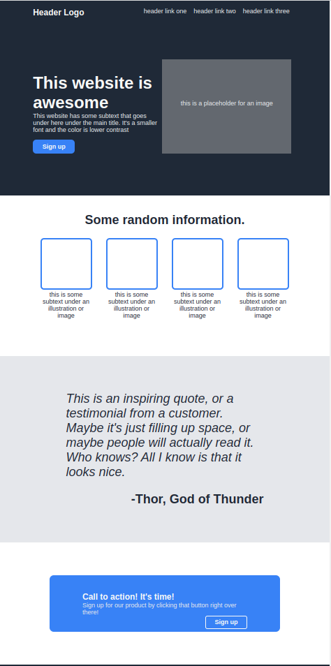

# odinLandingPage

<a name="readme-top"></a>

 <div align="center">

[](https://skillicons.dev)
[![LinkedIn][linkedin-shield]][linkedin-url]

</div>
<!-- PROJECT LOGO -->
<br />
<div align="center">
    <!--  -->

  <h3 align="center">Odin Landing Page</h3>

  <p align="center">
    A simple landing page using flexbox to learn how to work with many flexboxes in one page.
    <br />
    <br />
  </p>
</div>

https://pictogrammers.com/library/mdi/icon/shield-lock/ was mostly
used for images

<!-- ABOUT THE PROJECT -->

## About The Project



This project demonstrates the use of multiple flexboxes to create what resembles the landing page for a website. It includes a navbar, hero section, some product section, a quote section, and a footer.

<!-- Here's a blank template to get started: To avoid retyping too much info. Do a search and replace with your text editor for the following: `Andresr35`, `adminDashboard`, `twitter_handle`, `and-r`, `email_client`, `email`, `Admin Dashboard`, `project_description` -->

<p align="right">(<a href="#readme-top">back to top</a>)</p>

### Built With

[](https://skillicons.dev)

<p align="right">(<a href="#readme-top">back to top</a>)</p>

<!-- GETTING STARTED -->

## Getting Started

To get a local copy up and running follow these simple example steps.

<!--
### Prerequisites

You must install npm

- npm
  ```sh
  npm install npm@latest -g
  ``` -->

### Installation

1. Clone the repo
   ```sh
   git clone https://github.com/Andresr35/adminDashboard.git
   ```
   <!-- 2. Install NPM packages
      ```sh
      npm install
      ``` -->
      <p align="right">(<a href="#readme-top">back to top</a>)</p>

<!-- USAGE EXAMPLES -->

## Usage

Load the index.html onto your browser and enjoy the scenery!

<p align="right">(<a href="#readme-top">back to top</a>)</p>

## License

Distributed under the MIT License. See `LICENSE.txt` for more information.

<p align="right">(<a href="#readme-top">back to top</a>)</p>

<!-- CONTACT -->

## Contact

Your Name - andres.ruiz3561@gmail.com

Project Link: [https://github.com/Andresr35/odinLandingPage](https://github.com/Andresr35/odinLandingPage)

<p align="right">(<a href="#readme-top">back to top</a>)</p>

<p align="right">(<a href="#readme-top">back to top</a>)</p>

[linkedin-shield]: https://img.shields.io/badge/-LinkedIn-black.svg?style=for-the-badge&logo=linkedin&colorB=555
[linkedin-url]: https://www.linkedin.com/in/and-r/
